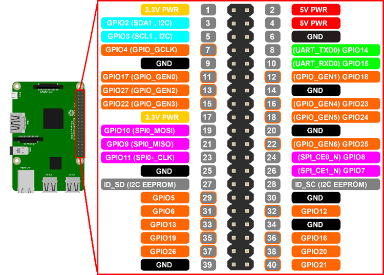
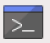
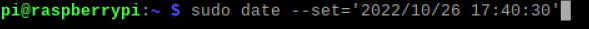
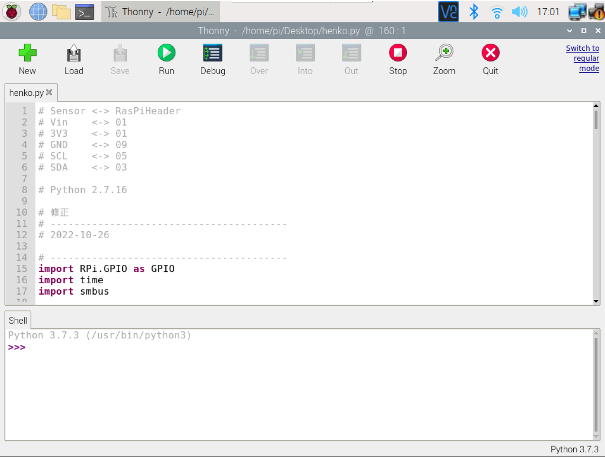
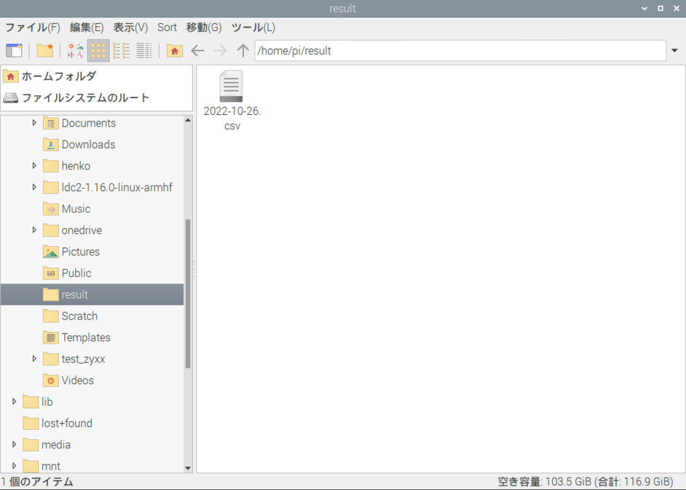

# 偏光測定器使い方
## 1.事前準備
### 1.1 配線

今回の線は5本あります。（番号　1,3,4,5,12,39 ）<br>
この図を参照して,それぞれの位置に差し込んでください。(電源を入れたままでも配線可能です。)<br>

しかし短絡をさせないように(配線ミスのないように)!

### 1.2 電源
電源を入れる前に、ラズベリーパイはモニター、マウス、キーボードと繋いでください。(推奨)

もし他の接続方法(putty　vncなど)を利用する場合、パソコンさえあれば大丈夫です。<br>
(注意：WiFiに繋がらないと、利用不可)

## 2.電源を入れた後
### 2.1　
電源を入れると、以下のようにラズベリーパイのディスクトップ画面が見える。

### 2.2時間設定(時間が合わない場合)
設定方法:<br>
上にあるをクリックしてください。<br>
以下のコードを入力してください。
```
sudo date --set='yyyy/mm/dd hh:mm:ss'
----------------------------------------
2022/10/26 17:40:30　を例として
sudo date --set='2022/10/26 17:40:30'
```
<br>
入力したら、エンターキーををしてください(実行する)。<br>
以上、時間設定完了
### 2.3 Wifi設定
参照ページ：http://igarashi-systems.com/sample/translation/raspberry-pi/configuration/wireless-cli.html <br>

ラズベリーパイをWiFiに繋ぐと、puttyまたはvncが使えるようになる<br>
測定器はWiFiに依存しないので、puttyまたはvncなどの使う予定がない場合、WiFiにつながらなくても大丈夫です。<br>

繋ぐ方法：<br>
先にをクリックしてください。

```
sudo nano /etc/wpa_supplicant/wpa_supplicant.conf
```
を実行して、ファイルの一番下まで行き、次を追加してください。
```
network={
    ssid="WiFiのネットワーク名"
    psk="WiFiのパスワード"
}
```
次に、ctrl+xを押してからyを押し、最後にenterを押してファイルを保存してください。<br>
保存したら、ラズベリーパイを再起動してください。

### 2.4固定IPアドレスを設定する
参照：https://mugeek.hatenablog.com/entry/2019/05/27/230256

現在IPアドレスを「192.168.11.18」に設定しています。

## 3.実験
### 3.1実験装置を設置する
### 3.2実験に関するプログラム
画面にある「henko.py」をダブルクリックしてください<br>すると以下のようになる

測定装置の設置が終わったら
<br>上にある「Run」をクリックしてください。<br>
すると、測定が始まります。
<br>測定が終わったら、ファイルの保存場所は以下のように示す。(保存場所は変更可能)
```
/home/pi/result/
```
図で表すと、
<br>
### 3.3 ファイル名、保存場所変更
プログラムの26~28行
```
#保存場所
result_path = '/home/pi/henko/result/'

#今の時間を調べる
time_local = time.strftime('%Y-%m-%d', time.localtime(time.time()))

#ファイル名は 「今の時間.csv」　になる
csv_file = result_path + '%s.csv' % time_local
```
を変えたらファイル名または保存場所が変わる。

## 4その他
### 4.1編集してもいい？
プログラムはバックアップ済みなので、ご自由に編集してください。
<br>バックアップ場所:
```
/home/pi/test_zyxx/henko.py
```

### 4.2測定が遅い？

105行と150行
```
    time.sleep(0.2)
```
の「0.2」を小さい数字にしてみてください。
一緒じゃなく、一つだけ変えてもオーケー。
しかし測定が速すぎると、データを読み取ることができない場合がある。