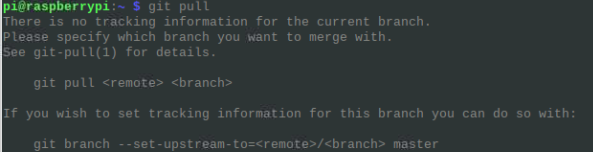
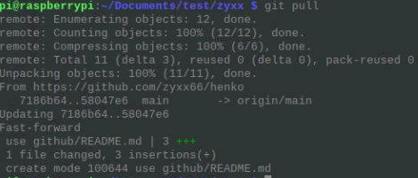

#update program files
## by using python
```
os.chdir('/home/pi/Documents/test/zyxx')
os.system('git pull')
```
一行目の　os.chdir　を実行すると<br>
この後の　os.system コマンドは<br>"/home/pi/Documents/test/zyxx"で実行するようになる
## by using cmd
効果として、raspberryのLXTerminalで
```
cd /home/pi/Documents/test/zyxx
git pull
```
と同じです
##be careful
```
git pull
```
はどこでも実行できるではない！ <br>
区別として、

フォルダに移動せずに、直接実行すると<br>
<br>
になる

フォルダに移動して
```
cd /home/pi/Documents/test/zyxx
```
git pullを実行すると<br>
<br>
このように、成功。