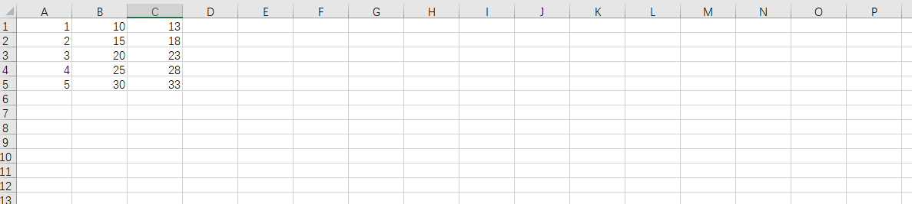
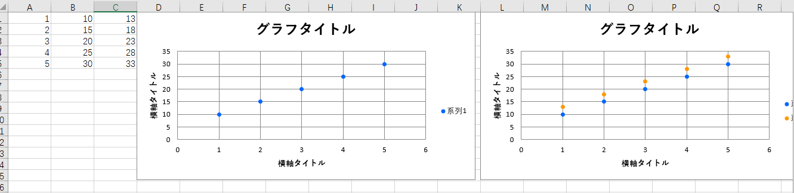

ここにあるのは「excel」と関係あるプログラム
# 各プログラムについて
## 0.ご注意
`openpyxl`がないと実行できないから、`事前にインストールすること`を忘れないように。
## 1.[create_graph](create_graph.py)
### 1.0　注意
プログラムを実行する時<br>`必ずグラフを作る対象のエクセルファイルを閉じること`
### 1.1紹介
ライブラリである
### 1.2使用方法
1.まずはimport
```
import create_graph
```
</pr>2.オブジェクト作る
```
指定した変数名 = create_graph.create_graph('エクセルファイル名','シート名')

例：example = create_graph.create_graph('C:/Users/test/Desktop/test_csv/test.xlsx','Sheet')
```
</pr>3.エクセルファイルを`一回`ロードする
```
指定した変数名.load()

例：excel_file = example.load()
```
<br>4.グラフを作る
```
指定した変数名.create_scatter(excel_file,グラフ横軸のタイトル,グラフ縦軸のタイトル,グラフのタイトル,グラフ置く場所,
                           [xデータ開始x,xデータ開始y,xデータ終了x,xデータ終了,yデータ開始x,yデータ開始y,yデータ終了x,yデータ終了y],……(データ無限追加可能))
```
データについての説明：
```
[1,1,1,5,2,1,2,5] とは xの値は(A1)から(A5)まで、Yの値は(B1)から(B5)まで
```
```
例１(1個のデータの場合)：
example.create_scatter(excel_file,'横軸タイトル','横軸タイトル','グラフタイトル','D1',[1,1,1,5,2,1,2,5])
例２(2個のデータの場合)：
example.create_scatter(excel_file,'横軸タイトル','横軸タイトル','グラフタイトル','L1',[1,1,1,5,2,1,2,5],[1,1,1,5,3,1,3,5])
```
3.プログラム例 [example](example.py)
```
import create_graph
example = create_graph.create_graph('D:/example_excel.xlsx', 'Sheet1')
# エクセルファイルをロードする
excel_file = example.load()
# 散布図を作る
example.create_scatter(excel_file,'横軸タイトル','横軸タイトル','グラフタイトル','D1',[1,1,1,5,2,1,2,5])
example.create_scatter(excel_file,'横軸タイトル','横軸タイトル','グラフタイトル','L1',[1,1,1,5,2,1,2,5],[1,1,1,5,3,1,3,5])
# エクセルファイル保存
example.save(excel_file)
```
結果：
<br>実行前：

<br>実行後：


## 2.[check_data](check_data.py)
```
(11行)　folder = 'C://Users/zyxx/Desktop/test_csv/'
```
にある全てのcsvファイル(測定器から貰ったデータ)をxlsxファイルに偏光して、散布図を追加する
<br>最後に雲量と偏光度を'sumup.csv'ファイルにまとめる。

