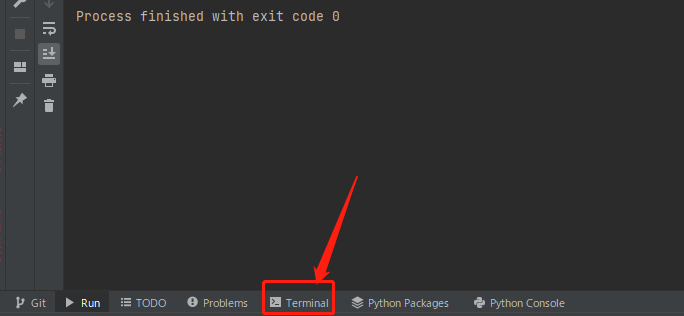
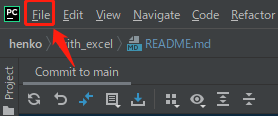
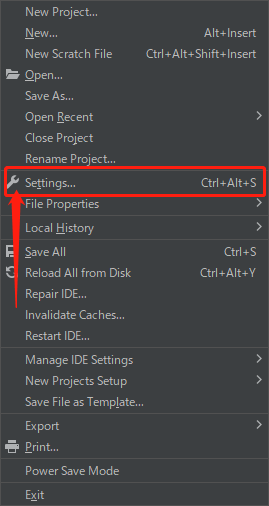
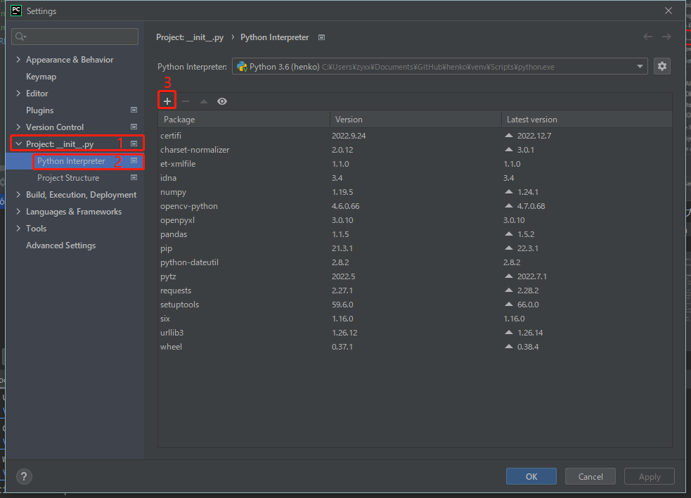
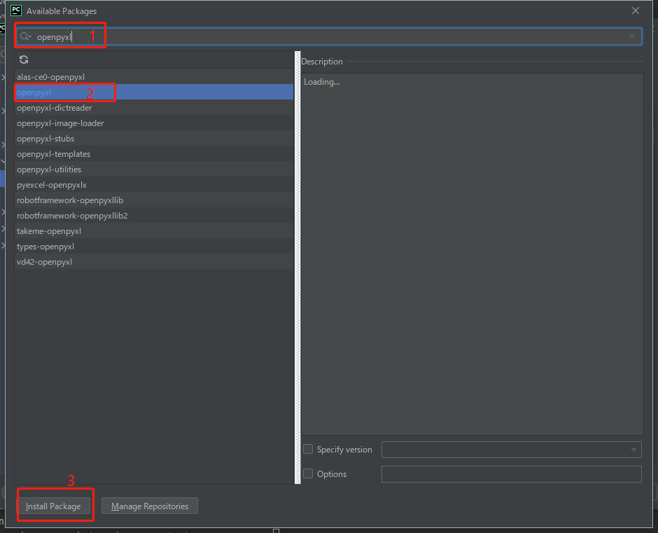
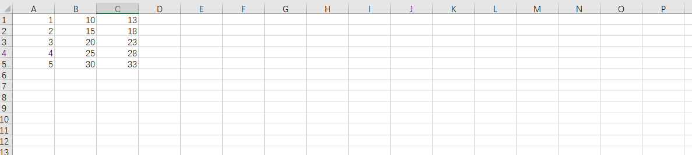
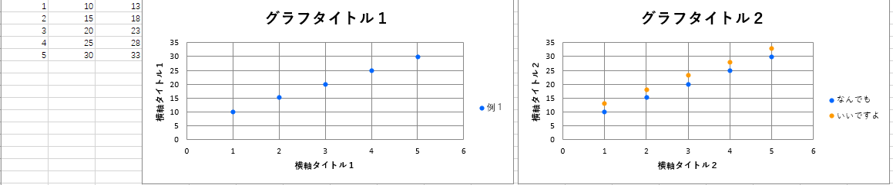

ここにあるのは「excel」と関係あるプログラム
# 各プログラムについて
## 0.ご注意
`openpyxl`がないと実行できないから、`事前にインストールすること`を忘れないように。
<br>インストール方法(パソコン(windows OS)の場合)：
* （自分は*PyCahrm*を用いてプログラムで作成しているので、今回はPyCharmを例として紹介します）
* PyCharmをダウンロードする：[ClickHere](https://www.jetbrains.com/ja-jp/pycharm/)
* もちろん無理せず自分に合う　プログラミング言語　と　IDE　を使ってくださいね
* 'opnepyxl'のインストール方法　１
  * 1.下にある`Terminal`を押して<br>
  
  * 2.pip install openpyxlを入力して<br>
  
  * エンターキーを押す<br>
* 'opnepyxl'のインストール方法　2
  * 1.上にある`File`を押して<br>
  
  * 2.`Setting...`を押して<br>
  
  * 3.自分のプロジェクト(プロジェクト名は図と違うかもしれない)中にある`Python Interpreter`を選択して,右にある`+`を押して<br>
  
  * 4.上に`openpyxl`を検索して、下の`openpyxl`を選択して、下の`Install Package`を押す<br>
  
## 1.[create_graph](create_graph.py)
### 1.0　注意
プログラムを実行する時<br>`必ずグラフを作る対象のエクセルファイルを閉じること`
### 1.1紹介
ライブラリである
### 1.2使用方法
1.まずはimport
```
import create_graph
```
</pr>2.オブジェクト作る
```
指定した変数名 = create_graph.create_graph('エクセルファイル名','シート名')

例：example = create_graph.create_graph('C:/Users/test/Desktop/test_csv/test.xlsx','Sheet')
```
</pr>3.エクセルファイルを`一回`ロードする
```
指定した変数名.load()

例：excel_file = example.load()
```
<br>4.グラフを作る
```
指定した変数名.create_scatter(excel_file,グラフ横軸のタイトル,グラフ縦軸のタイトル,グラフのタイトル,グラフ置く場所,
                           [[xデータ開始x,xデータ開始y,xデータ終了x,xデータ終了,yデータ開始x,yデータ開始y,yデータ終了x,yデータ終了y],……(データ無限追加可能)])
```
データについての説明：
```
[1,1,1,5,2,1,2,5] とは xの値は(A1)から(A5)まで、Yの値は(B1)から(B5)まで
```
```
例１(1個のデータの場合)：
example.create_scatter(excel_file,'横軸タイトル１','横軸タイトル１','グラフタイトル１','D1',[[1,1,1,5,2,1,2,5,'例１']])
例２(複数のデータの場合)：
example.create_scatter(excel_file,'横軸タイトル２','横軸タイトル２','グラフタイトル２','L1',[[1,1,1,5,2,1,2,5,'なんでも'],[1,1,1,5,3,1,3,5,'いいですよ']])
```
3.プログラム例 [example](example.py)<br>
事前に[example_excel](example_excel.xlsx)をパソコンの`D://`に保存すること
```
import create_graph
example = create_graph.create_graph('D:/example_excel.xlsx', 'Sheet1')
# エクセルファイルをロードする
excel_file = example.load()
import create_graph
example = create_graph.create_graph('D:/example_excel.xlsx', 'Sheet1')
# エクセルファイルをロードする
excel_file = example.load()
# 散布図を作る
example.create_scatter(excel_file,'横軸タイトル１','横軸タイトル１','グラフタイトル１','D1',[[1,1,1,5,2,1,2,5,'例１']])
example.create_scatter(excel_file,'横軸タイトル２','横軸タイトル２','グラフタイトル２','L1',[[1,1,1,5,2,1,2,5,'なんでも'],[1,1,1,5,3,1,3,5,'いいですよ']])
# エクセルファイル保存
example.save(excel_file)
```
結果：
<br>実行前：

<br>実行後：


## 2.[check_data](check_data.py)
```
(11行)　folder = 'C://Users/zyxx/Desktop/test_csv/'
```
にある全てのcsvファイル(測定器から貰ったデータ)をxlsxファイルに偏光して、散布図を追加する
<br>最後に雲量と偏光度を'sumup.csv'ファイルにまとめる。

